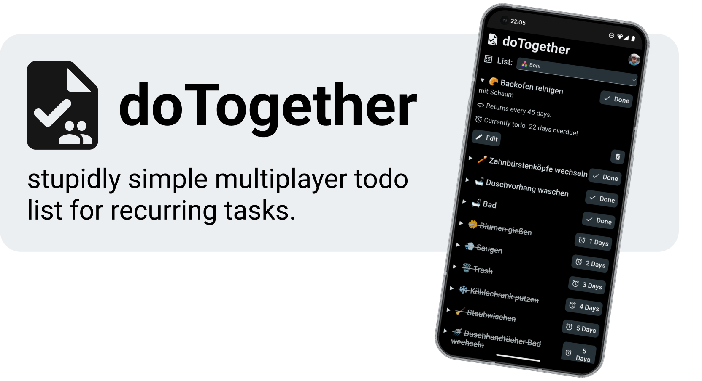

[](https://do-together.vercel.app/)

[**doTogether**](https://do-together.vercel.app/) helps you keep track of stuff you have get done via **a List of recurring Tasks**.

Each **Task** has a certain number of days it takes to recur. When you mark a Task as done, it will recur after that set amount of days. **Lists** contain Tasks and can be shared with other people, so you can work on Tasks together. The List is ordered by the remaining / overdue days of each Task.

The app is build to be as **simple as possible**, so you can focus on getting stuff done instead of figuring out all the features. It's also build to be used with multiple people. **Realtime data** means the Lists are always in sync and up to date, but you can of course also use the app by yourself. You can create a List for your shared home chores and one for your daily habits!

The app is completely open source and free to use. To get started, login with your Google account under https://do-together.vercel.app/. We don't save any personal data.

## Self Hosting Guide

If you want, you can setup and host the components yourself.

This includes a **Firebase project** for auth and database and the **frontend** for the UI.

This can all be setup completely free, without a credit card, using the following method:

1. Setup Firebase:

   1. A Google account is required to access the Firebase console, and to login to the frontend
   1. Inside the [Firebase console](https://console.firebase.google.com/u/0/) click "Add project" and follow the wizard
   1. Activate "Authentication" and go to "Sign-in method" and click "Add new provider" to add the Google Sign-in provider
   1. Activate "Realtime Database" and under "Rules" set the following:

      ```json
      {
      	"rules": {
      		"lists": {
      			"$list_id": {
      				".read": "data.child('key').val() === root.child('members').child(auth.uid).child($list_id).val()",
      				".write": "data.child('key').val() === root.child('members').child(auth.uid).child($list_id).val()"
      			}
      		},
      		"members": {
      			"$user_id": {
      				".read": "$user_id === auth.uid",
      				".write": "$user_id === auth.uid"
      			}
      		}
      	}
      }
      ```

      1. These rules define what users can read and write to your database. It describes, members can only edit lists whose key they own.

   1. Go to "Project Overview", click "Add app", then "</> Web" and then register a new app

1. Host your frontend and Setup environment variables
   1. I'm using [Vercel](https://vercel.com/) to host the frontend (but any other cloud host supported by SvelteKit with an Adapter should work)
   1. Fork this Repo and login to [Vercel](https://vercel.com/) using GitHub
   1. Click "new Project" and select the forked repo form the "Import Git Repository" section
   1. Under "Build and Output Settings" set "INSTALL COMMAND" to `pnpm install`
   1. **Don't** click deploy right away! We need to set up environment variables now...
   1. Go to back to Firebase console and click the cog next to "Project Overview" and go to "Project settings"
   1. Scroll down to see your apps and note the textbox with the `firebaseConfig`
   1. Setup the Vercel environment variables according to first 7 keys from the `/.env_template` file
   1. Generate a strong password / private key and set it as an environment variable with the key `VITE_CRON_KEY`
   1. Click the cog next to Project Overview, select Project settings, Service accounts and click Generate new private key
   1. Copy over the last two fields according to the `/.env_template` file from the json file
   1. Now you can click "Deploy"

## Development

1. Follow the Setup Guide, hosting the frontend can be skipped.
1. Setup the environment variables from the hosting step in a `.env` file (You can copy the `.env_template` for this)
1. Install [pnpm](https://pnpm.io/installation)
1. Run `pnpm i`
1. Run `pnpm dev`
